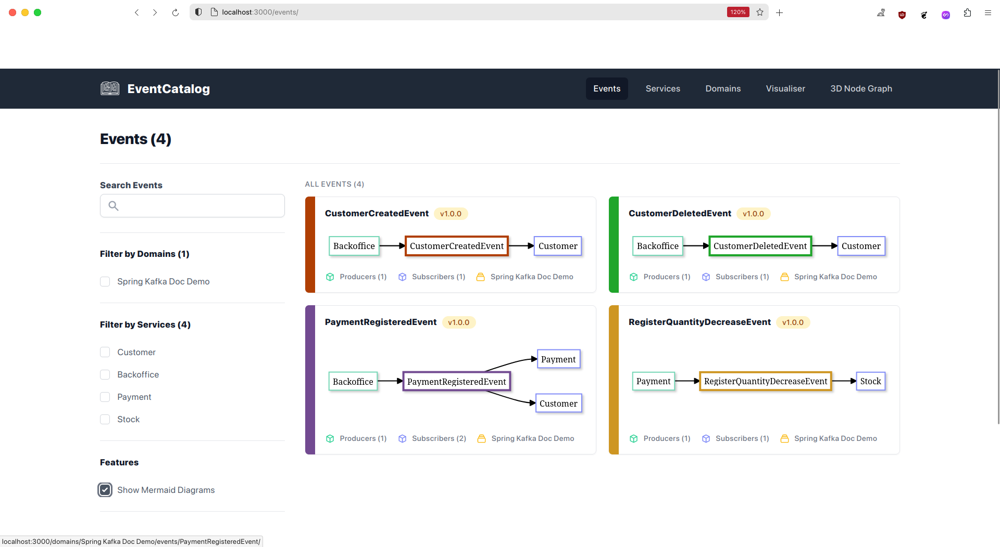
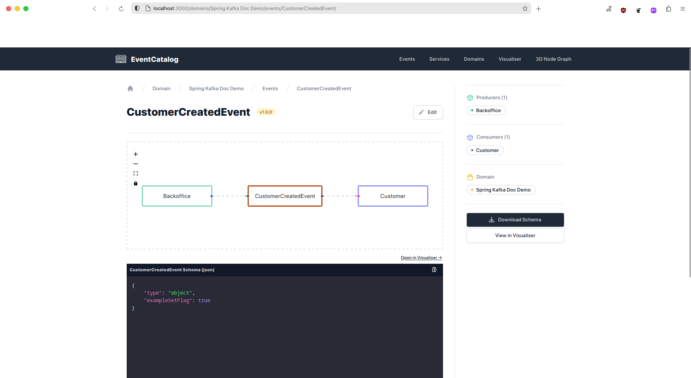
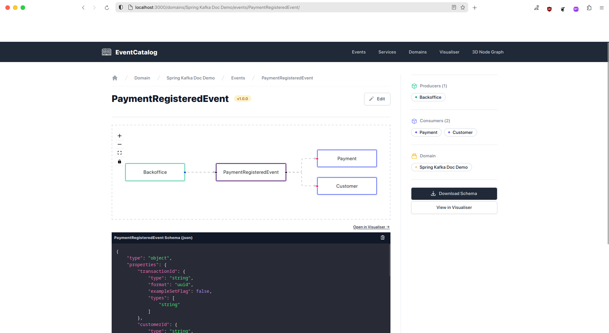
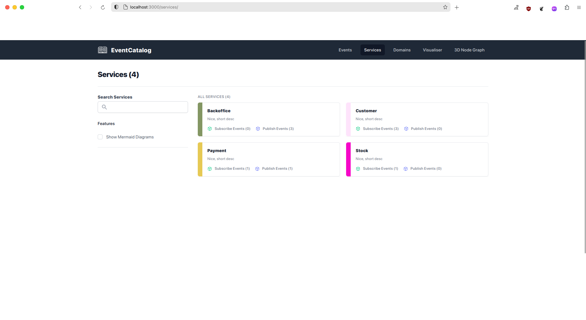
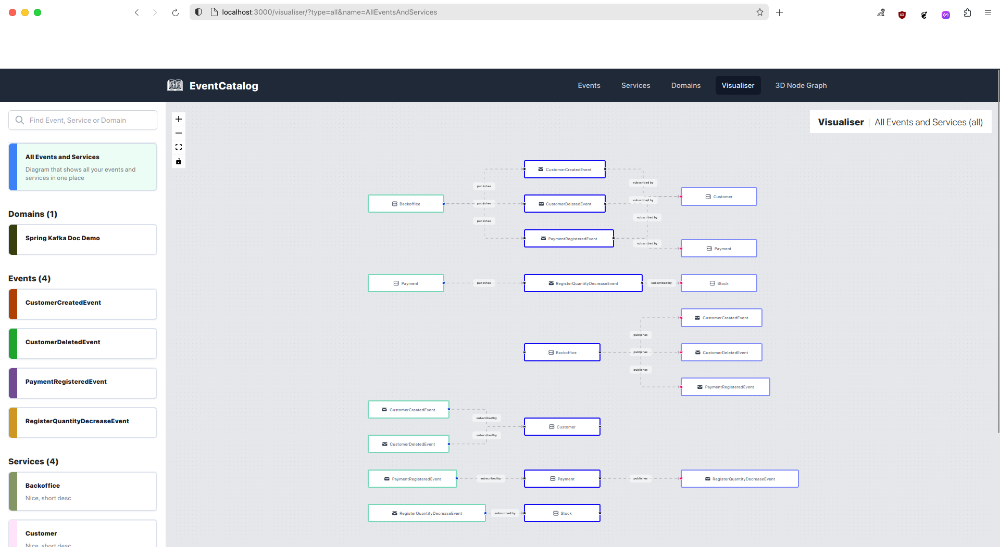

# Spring kafka doc with Event-Catalog
The Spring Kafka Doc is an open-source library that aims to document all events generated by Kafka in real-time. It outputs the events in either YAML or JSON format, which can then be visualized with other tools like Event Catalog.
For bringing this yaml support to Spring projects, you can follow the [Spring Kafka Doc readme](https://github.com/DogusTeknoloji/springkafkadoc)

### Setting up Spring Kafka Doc

To document the events between your services, you'll need to follow the instructions in the Spring Kafka Doc readme. Once you've set up the Spring configurations, the library will automatically create endpoints for YAML and JSON files at ip:port/springkafkadoc/json and ip:port/springkafkadoc/yaml respectively. Make sure to exclude these endpoints in your web filters.


### Visualizing events with Event Catalog
To visualize the events documented by Spring Kafka Doc, you'll use the Event Catalog visualization tool.

1. Create a demo project for Event Catalog with the following command:


```
npx @eventcatalog/create-eventcatalog@latest [name]
```
2. Install the plugin for generating documents:

``` shell
npm install --save @eventcatalog/plugin-doc-generator-asyncapi
```

Once you've downloaded [demo project](https://www.eventcatalog.dev/docs/installation) from event-catalog, we will create a node project inside it. 

3. Create a Node.js project within the demo project and make HTTP calls to the endpoints created by Spring Kafka Doc. The responses should be saved as YAML files:

``` javascript
import fs from "fs";
import axios from "axios";

clearDir("./services")
clearDir("./events")
clearDir(".domains")
clearDir("./async-api-files")

const urls = [
  "http://localhost:8080",
  "http://localhost:8081",
  "http://localhost:8082",
  "http://localhost:8083"
]

const baseUrls = urls.map(url => axios.create({ baseURL: url }))

for (const baseUrl of baseUrls) {
  const response = await baseUrl.get("/springkafkadoc/yaml");
  const url = baseUrl.defaults.baseURL
  fs.writeFileSync(`./async-api-files/${url.substring(url.lastIndexOf("/") + 1)}.yml`, response.data);
}


function clearDir(directory) {
  fs.rmSync(directory, { recursive: true, force: true });
  if (!fs.existsSync(directory)) {
    fs.mkdirSync(directory);
  }
}
```

Make sure that the file hierarchy are the same as the example, or you should modify it for your needs.

To generate the markdowns that event-catalog will use to visualize the events, we are going to use event-catalog doc generator plugin
You can follow the event-catalog's tutorial for this.

4. Use the Event Catalog doc generator plugin to generate markdown files for visualization. Add the following code in the eventcatalog.config.js file:

``` javascript
const urls = [
  "http://localhost:8080",
  "http://localhost:8081",
  "http://localhost:8082",
  "http://localhost:8083"
]

module.exports {
  // ...
  generators: [
    [
      '@eventcatalog/plugin-doc-generator-asyncapi',
      {
        pathToSpec: urls.map(url => path.join(__dirname, `./async-api-files/${url.substring(url.lastIndexOf("/") + 1)}.yml`)),
        domainName: "Spring Kafka Doc Demo",
        renderNodeGraph: true,
        versionEvents: false
      },
    ],
  ],
  // ...
```
Note: You can adjust the file hierarchy to your preference.


Modify the npm commands in your package.json file to ease the running process:

``` javascript
"scripts": {
    "start": "eventcatalog start",
    "get-yamls": "node ./async-api-yml-creator/index.js",
    "dev": "eventcatalog generate && eventcatalog dev",
    "build": "eventcatalog build",
    "generate": "eventcatalog generate",
    "test": "echo \"Error: no test specified\" && exit 1"
  },
```

***

With these steps in place, you should be ready to go.
1. To generate the markdown files, run `npm run get-yamls` to get the yaml files, then run `npm run generate` to generate the md files for events.
2. After the file generation phase, you can either build the generated files with `npm run build` then start server `with npm run start` or continue live generation with Next.js using `npm run dev`.



***

***

***

***

****
